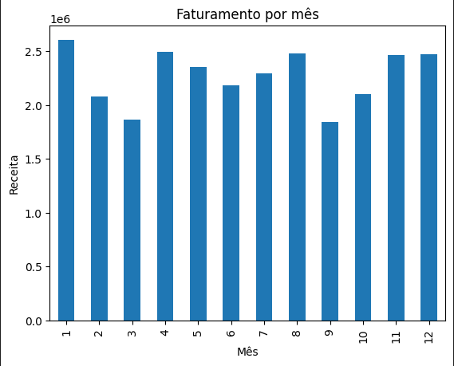

# 📊 Análise de Dados de Vendas

Este projeto tem como objetivo analisar dados de vendas, identificando padrões de faturamento, comportamento de produtos e possíveis oportunidades de melhoria.

## 🛠️ Tecnologias utilizadas

* Python
* Pandas
* Matplotlib
* Jupyter Notebook
* Power BI

## 📈 Análises realizadas

* Faturamento total
* Faturamento por mês
* Produtos mais vendidos
* Criação de variáveis (mês e ano)
* Visualização de dados

## 🧠 Insights

Foi possível identificar variações no faturamento ao longo dos meses, sugerindo possíveis sazonalidades. Além disso, alguns produtos se destacam em volume de vendas, indicando maior aceitação no mercado.

## 📂 Estrutura do projeto

* `dados/` → base de dados utilizada
* `analise_vendas.ipynb` → análise em Python

## 🚀 Objetivo

Este projeto foi desenvolvido com foco em aprendizado e construção de portfólio para a área de análise de dados.

## 📎 Visualização do Projeto

Para facilitar a visualização da análise sem necessidade de executar o código, o projeto também está disponível em formato HTML:

👉 [Clique aqui para visualizar](./analise_vendas.html)

## 📊 Exemplo de análise

